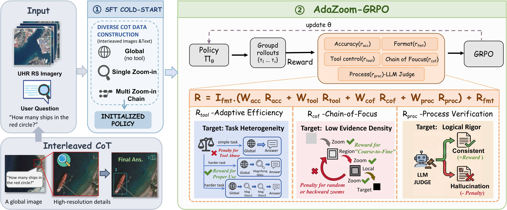

<div align="center">
  <h2><strong>GeoEyes: On-Demand Visual Focusing for Evidence-Grounded Understanding of Ultra-High-Resolution Remote Sensing Imagery</strong></h2>
  <p>
    <strong>Fengxiang Wang</strong><sup>1</sup>, 
    <strong>Mingshuo Chen</strong><sup>2</sup>, 
    <strong>Yueying Li</strong><sup>1</sup>, 
    <strong>Yajie Yang</strong><sup>3</sup>, 
    <strong>Yifan Zhang</strong><sup>4*</sup>, 
    <strong>Long Lan</strong><sup>1</sup>
    <br>
    <strong>Xue Yang</strong><sup>5</sup>, 
    <strong>Hongda Sun</strong><sup>6*</sup>, 
    <strong>Yulin Wang</strong><sup>7</sup>, 
    <strong>Di Wang</strong><sup>8</sup>, 
    <strong>Jing Zhang</strong><sup>8</sup>, 
    <strong>Jun Song</strong><sup>*</sup>, 
    <strong>Bo Du</strong><sup>8</sup>
  </p>
  <p>
    <sup>1</sup>National University of Defense Technology, 
    <sup>2</sup>Beijing University of Posts and Telecommunications
    <br>
    <sup>3</sup>University of the Chinese Academy of Sciences, 
    <sup>4</sup>Chinese Academy of Science
    <br>
    <sup>5</sup>Shanghai Jiao Tong University, 
    <sup>6</sup>Renmin University of China, 
    <sup>7</sup>Tsinghua University, 
    <sup>8</sup>Wuhan University
    </p> 
</div>
<div align="center">
  <a href="https://arxiv.org/abs/2601.00000"></a> 
    <a href="https://huggingface.co/datasets/initiacms/UHR-CoZ"></a> 
    <a href="https://huggingface.co/initiacms/GeoEyes"></a>
</div>

## 📚 Contents

- [📚Contents](#-contents)
- [🔍Overview](#overview)
- [🌐UHR-CoZ Dataset](#uhr-coz-dataset)
- [🛠️Methodology & Training](#methodology--training)
- [🚀Evaluation](#evaluation)
- [🤝Acknowledgement](#acknowledgement)

## 🔍Overview



<p align="center"><strong>Fig 1. Overview of the AdaZoom-GRPO Framework.</strong></p>

We introduce **GeoEyes**, a specialized MLLM for Ultra-High-Resolution (UHR) Remote Sensing. Current "thinking-with-images" models suffer from **Tool Usage Homogenization**—collapsing into rigid, one-size-fits-all zooming patterns that fail to address the task heterogeneity and low evidence density of UHR imagery.

To solve this, we propose a staged training framework:
1.  **Cold-Start SFT**: Initializing the model with **UHR-CoZ**, a dataset containing diverse "Chain-of-Zoom" trajectories (Global, Single-Zoom, Multi-Step).
2.  **AdaZoom-GRPO**: An Agentic Reinforcement Learning stage with a novel reward system designed to incentivize **on-demand zooming** and **progressive focusing**.

Our method achieves **54.23% accuracy on XLRS-Bench**, establishing a new state-of-the-art by outperforming larger models like Qwen2.5-VL-72B and domain-specific agents like DeepEyes.

## 🌐UHR-CoZ Dataset

We construct **UHR Chain-of-Zoom (UHR-CoZ)**, the first large-scale interleaved image-text chain-of-thought dataset specifically for UHR remote sensing. It is built using an automated agentic pipeline (Fig 2) involving **GLM-4.5V**, which generates multi-round zoom-in trajectories cleaned by a semantic scorer.


<p align="center"><strong>Fig 2. Automated data construction pipeline for UHR-CoZ.</strong></p>

### Dataset Statistics

| Statistics                | Value         |
| :------------------------ | :------------ |
| **Total Samples**         | **25,467**    |
| Avg. Image Resolution     | 2,178 × 2,051 |
| Zoom-in Depth 1 (No Zoom) | 6.4%          |
| Zoom-in Depth 2           | 86.7%         |
| Zoom-in Depth $\ge 3$     | 6.9%          |
| Avg. Reasoning Length     | 157.8 tokens  |

## 🛠️Methodology & Training

Our approach builds upon the **DeepEyes** framework, introducing a two-stage optimization process.

### 1. Prepare Data

* **UHR-CoZ**: Download our constructed SFT dataset with interleaved zoom trajectories through [huggingface](https://huggingface.co/datasets/initiacms/UHR-CoZ).
* **SuperRS-VQA**: Used during the RL stage to enhance task diversity which is included in UHR-CoZ.
* **General RL Data**: We utilize [DeepEyes-47K](https://huggingface.co/datasets/ChenShawn/DeepEyes-Datasets-47k) for general reasoning stability.

### 2. Training Stages

The code base is develeped using torch2.6/2.8+cu128 and Python3.10/3.11.

#### Stage 1: Cold-Start SFT
We perform Supervised Fine-Tuning on UHR-CoZ to initialize the policy with basic tool capabilities and stop-conditions.

```bash
# 1. Download and prepare sft data from huggingface
# please make sure to modify the absolute image paths in UHR-CoZ.json
# 2. SFT using llamafactory
# We use this specific commit: https://github.com/hiyouga/LlamaFactory/tree/2a822178dea4d1c05f595521dd883a8e4f4e2e77
# if encountered TypeError during dataset preprocess, refer to https://github.com/hiyouga/LlamaFactory/issues/5613
# modify json paths in dataset_info.json and yaml file
llamafactory-cli train config.yaml
```

#### Stage 2: AdaZoom-GRPO (Agentic RL)

We optimize the model using **Group Relative Policy Optimization (GRPO)** with our specific reward formulation:

* **Adaptive Efficiency Reward** (Penalizes redundant tools on easy tasks).
* **Chain-of-Focus Reward** (Geometric containment reward for progressive zoom).
* **Necessity-Aware Process Verification** (LLM-based judge for logical rigor).

```bash
# 1. first install DeepEyes following https://github.com/Visual-Agent/DeepEyes
# we also provided a clean requirements.txt without torch package
# 2. download RL data, and modify parquet file paths in the training script/yaml file
# there are 3 parquets from DeepEyes-47k and 1 parquet file from UHR-CoZ HF repo
# 3. follow deepeyes to set LLM judge and start training using
# export LLM_AS_A_JUDGE_BASE="http://{IP}:{PORT}/v1"
python -m verl.trainer.main_ppo \
    --config-path DeepEyes/config \
    --config-name deepeyes_coz
```

## 🚀Evaluation

We evaluate on **XLRS-Bench**, focusing on Perception (e.g., Counting, Object Classification) and Reasoning (e.g., Route Planning, Anomaly Detection) tasks.

### Running Evaluation

```bash
# 0. execute the prepare_xlrs_data.ipynb to preprocess the evaluation data
# 1. convert model from pt format to hf model
bash s1.sh
# 2. deploy model using vllm (or ray using `serve run ray.yaml`)
bash s21.sh
# 3. prompting vllm
bash s22.sh
# 4. calculate metrics
bash s232.sh
```

### Main Results (XLRS-Bench)


# 🤝Acknowledgement

This repo benefits from [DeepEyes](https://github.com/Visual-Agent/DeepEyes) and [LLaMA-Factory](https://github.com/hiyouga/LlamaFactory). Thanks for their wonderful works.

